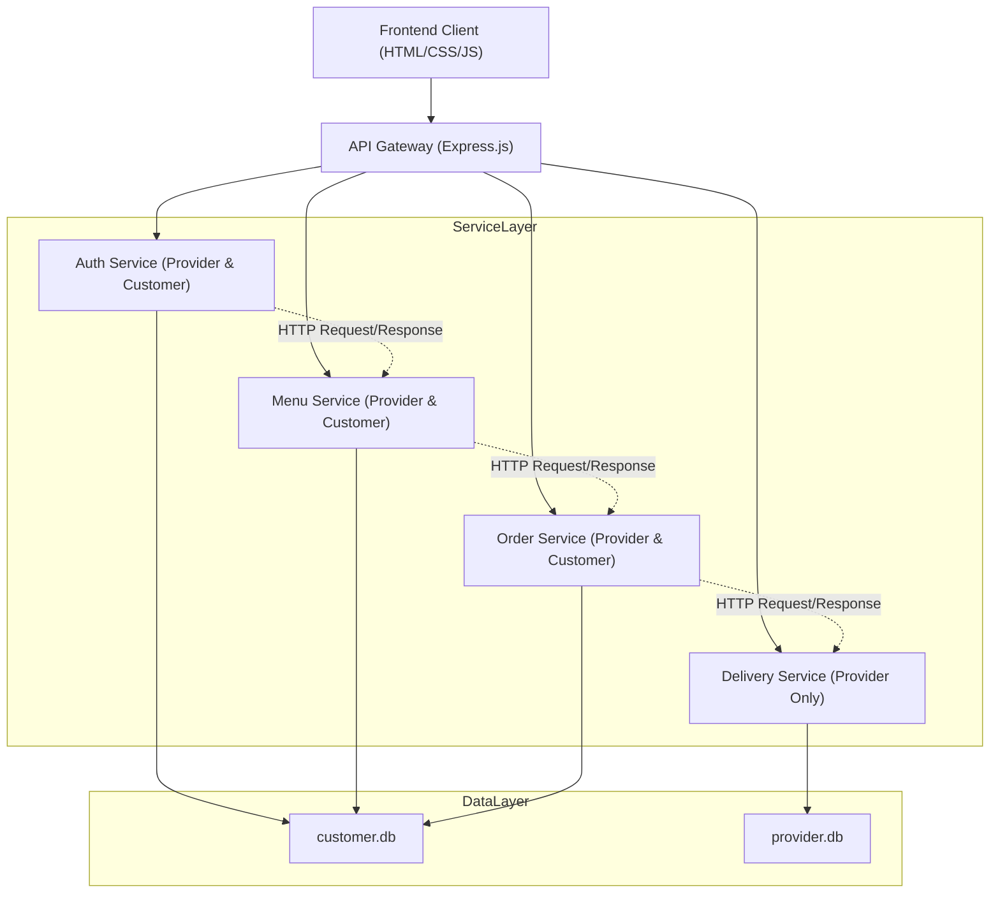
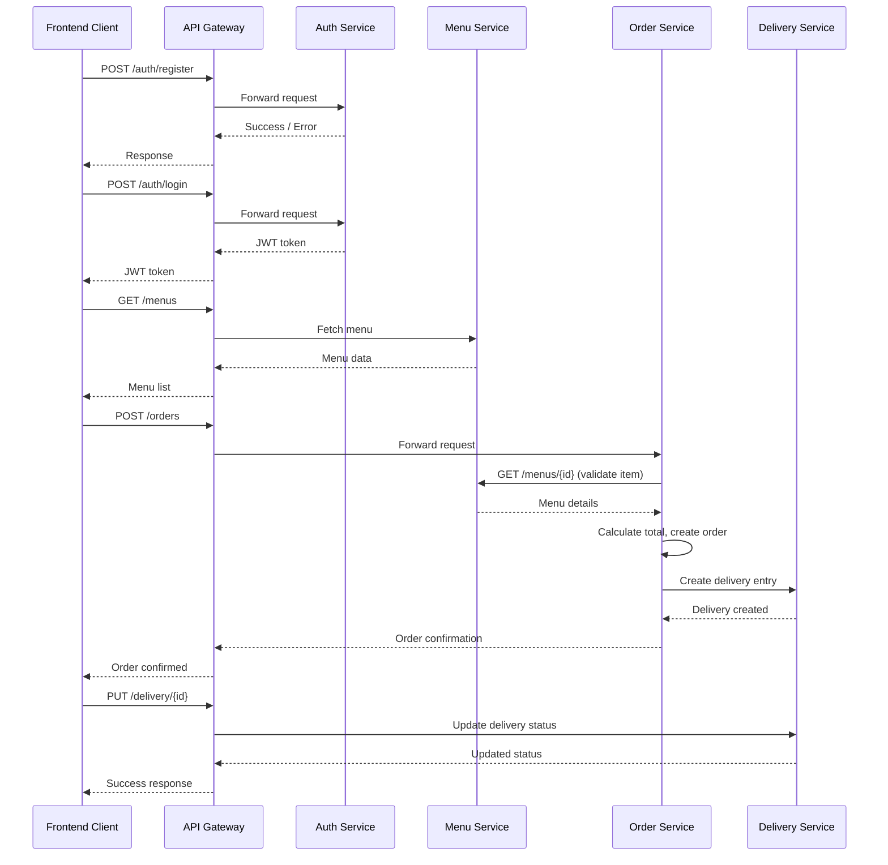

# 🍽️ Food Delivery System 
Website food delivery dengan arsitektur Client → API Gateway → Services → Database.
Terdapat dua jenis pengguna:
- Customer → dapat melihat menu, menambah ke keranjang, checkout, dan melihat order.
- Provider (Admin) → dapat mengelola menu & delivery (customer tidak dapat mengakses halaman delivery).
Dibangun menggunakan HTML, CSS, Node.js, Express, SQLite, Axios, CORS, Morgan.

**🚀 1. Deskripsi Singkat Proyek**
Proyek ini merupakan aplikasi web sederhana untuk layanan pemesanan makanan online.
Sistem dibangun dengan pemisahan modul berdasarkan fungsi layanan:
- Auth Service
- Menu Service
- Order Service
- Delivery Service

Frontend berkomunikasi dengan backend menggunakan REST API melalui API Gateway.

Fitur Utama:
- Register & Login
- Menu makanan
- Keranjang
- Checkout & Order
- Pengelolaan delivery
- Logout

**🏛️ 2. Arsitektur Sistem**



**Alur Komunikasi**


**🛠️ 3. Cara Menjalankan Aplikasi**

3.1. Instalasi Dependency
Terdapat dua backend:
- Customer Service (CS)
- Provider Service (PS)

A. Backend Customer Service (CS)

Masuk ke folder CS:
```bash
cd customer-service/backend
```
Install dependency:
```bash
npm install express sqlite3 dotenv cors helmet morgan axios
```
Jalankan service:
```bash
npm start
```

B. Backend Provider Service (PS)

Masuk ke folder PS:
```bash
cd provider-service/backend
```
Install dependency:
```bash
npm install express sqlite3 dotenv cors helmet morgan
```
Jalankan service:
```bash
npm start
```

**RUN MENGGUNAKAN 2 TERMINAL**

**ATAU GUNAKAN SCRIPT HELPER (Lebih Mudah):**

Jalankan kedua service sekaligus:
```bash
./start-services.sh
```

Hentikan kedua service:
```bash
./stop-services.sh
```

**Catatan Port:**
- Provider-service: **Port 4001** (http://localhost:4001)
- Customer-service: **Port 4002** (http://localhost:4002)

**⚠️ PENTING:** Pastikan kedua service menggunakan port yang berbeda!

3.2. Environment Variable

Customer Service
```.env
PORT=4002
PROVIDER_BASE_URL=http://localhost:4001
JWT_SECRET=supersecretkey
JWT_EXPIRES_IN=1d
```
Provider Service
```.env
PORT=4001
```

**🧑‍🤝‍🧑 4. Anggota & Peran**
| Nama | Peran |
|------|--------|
| Annisa Safitri Rahmadhani Harahap | Delivery Service (Fullstack) |
| Khalila Aziza Gunawan | Menu Service (Fullstack) |
| Lola Anggita Citrawilis | Order Service (Fullstack) |
| Sanitra Savitri | Auth Service (Fullstack) |

**📡 5. Ringkasan Endpoint (API Gateway)**

Auth Service

Customer Endpoints
```bash
POST /auth/login           - Login sebagai admin kemudian mendapatkan token
POST /auth/login           - Login sebagai customer kemudian mendapatkan token
```
Orders Service 

Customer Endpoints
```bash
GET  /orders               - Mendapatkan semua data pesanan (khusus admin)
```
Provider Endpoints
```bash
GET  /restaurants/1/menus  - Mengambil daftar menu dari Provider
```
Delivery Service 

Customer Endpoints
```bash
GET  /deliveries/:id       - Mendapatkan detail delivery tertentu
GET  /deliveries           - Mendapatkan semua data delivery
PUT  /deliveries/:id       - Mengupdate status delivery (misal dari Dikemas → Dibatalkan)
```
