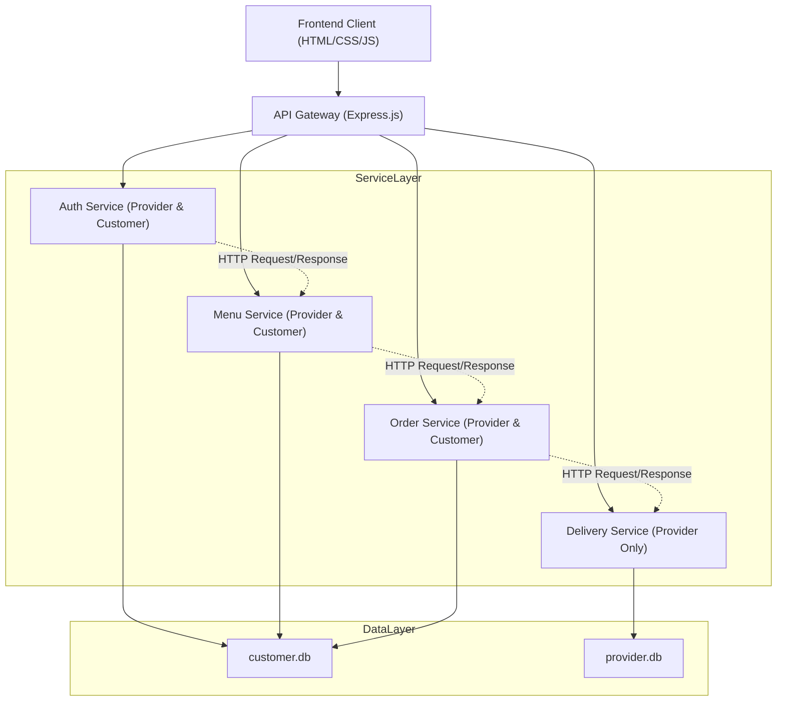

# 🍽️ Food Delivery System 
Website food delivery dengan arsitektur Client → API Gateway → Services → Database.
Terdapat dua jenis pengguna:
- Customer → dapat melihat menu, menambah ke keranjang, checkout, dan melihat order.
- Provider (Admin) → dapat mengelola menu & delivery (customer tidak dapat mengakses halaman delivery).
Dibangun menggunakan HTML, CSS, Node.js, Express, SQLite, Axios, CORS, Morgan.

**🚀 1. Deskripsi Singkat Proyek**
Proyek ini merupakan aplikasi web sederhana untuk layanan pemesanan makanan online.
Sistem dibangun dengan pemisahan modul berdasarkan fungsi layanan:
- Auth Service
- Menu Service
- Order Service
- Delivery Service

Frontend berkomunikasi dengan backend menggunakan REST API melalui API Gateway.

Fitur Utama:
- Register & Login
- Menu makanan
- Keranjang
- Checkout & Order
- Pengelolaan delivery
- Logout

**🏛️ 2. Arsitektur Sistem**




**🛠️ 3. Cara Menjalankan Aplikasi**

3.1. Instalasi Dependency
Terdapat dua backend:
- Customer Service (CS) → membutuhkan axios
- Provider Service (PS) → tidak membutuhkan axios

A. Backend Customer Service (CS)

Masuk ke folder CS:
```bash
cd backend/customer-service
```
Install dependency:
```bash
npm install express sqlite3 dotenv cors helmet morgan axios
```
Jalankan service:
```bash
npm start
```

B. Backend Provider Service (PS)

Masuk ke folder PS:
```bash
cd backend/provider-service
```
Install dependency:
```bash
npm install express sqlite3 dotenv cors helmet morgan
```
Jalankan service:
```bash
npm start
```

3.2. Environment Variable

Customer Service
```.env
PORT=4002
PROVIDER_BASE_URL=http://localhost:4001
JWT_SECRET=supersecretkey
JWT_EXPIRES_IN=1d
```
Provider Service
```.env
PORT=4001
```

**🧑‍🤝‍🧑 4. Anggota & Peran**
| Nama | Peran |
|------|--------|
| Annisa Safitri Rahmadhani Harahap | Delivery Service (Fullstack) |
| Khalila Aziza Gunawan | Menu Service (Fullstack) |
| Lola Anggita Citrawilis | Order Service (Fullstack) |
| Sanitra Savitri | Auth Service (Fullstack) |

**📡 5. Ringkasan Endpoint (API Gateway)**
/// tolong diisi

